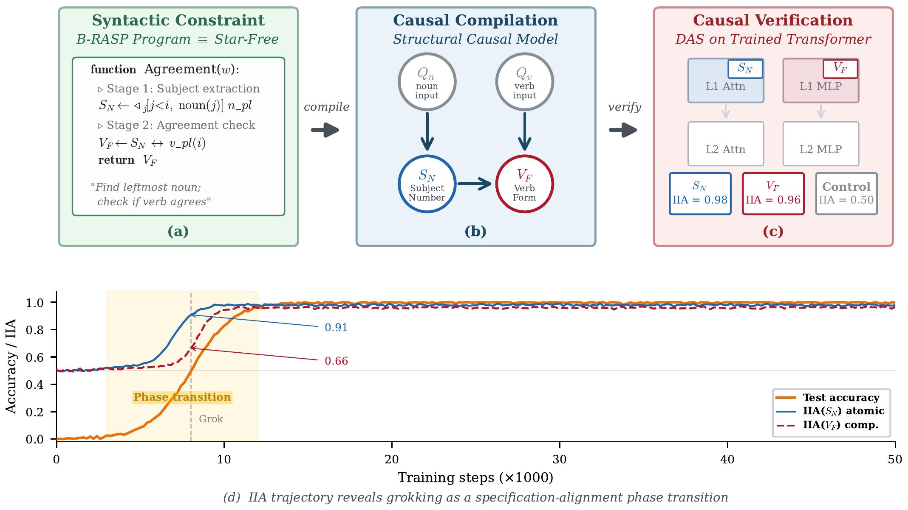

# BRASP-VERIFY 🔬

[](https://www.python.org/downloads/)
[](https://pytorch.org/)
[](https://developer.nvidia.com/cuda-toolkit)
[](LICENSE)

> **From Specification to Causal Verification: Do Transformers Implement Formally Prescribed Algorithms for Syntax?**
> *Anonymous submission to EMNLP 2026 (ARR May 2026)*

## TL;DR

We compile **B-RASP programs** (formal specifications of syntactic algorithms) into **structural causal models**, then use **Distributed Alignment Search (DAS)** to causally verify whether Transformers actually implement the prescribed intermediate computations. Short answer: *yes, they do* (IIA >= 0.95), and the variables emerge during training in exactly the order the causal model predicts.

<p align="center">
  
</p>

---

## Key Results

| Finding | Table/Fig | Highlight |
|:---|:---:|:---|
| From-scratch TF achieves IIA >= 0.95 on all 8 variables | Table 3 | Near-perfect causal alignment |
| Pre-trained models (160M-3B) reach IIA 0.82-0.95 | Table 3 | Alignment scales with model size |
| Variables emerge in causal-dependency order during grokking | Figure 3 | Atomic before compositional |
| SAE features fail on compositional variables; DAS succeeds | Table 4 | Structural limit of dictionary learning |
| Transformer-Mamba succinctness gap on agreement | Figure 4 | TF flat >=95%; Mamba drops to 53% |
| All negative controls return chance-level IIA (0.48-0.51) | Table 3 | High IIA is not an artifact |

---

## Repository Structure

```
brasp-verify/
|-- README.md
|-- requirements.txt
|-- LICENSE
|
|-- configs/
|   |-- transformer.yaml        # d=128, H=4, 2 layers, GELU, AdamW
|   |-- lstm.yaml               # Matched params (~1.08M)
|   |-- mamba.yaml              # Matched params (~1.15M), d_state=16
|   |-- das.yaml                # Cayley rotation, rank in {1,2,4,8}
|
|-- src/
|   |-- data/
|   |   |-- cfg_generator.py    # CFG sentence generation (4 phenomena, d=0..8)
|   |   |-- lexicon.py          # 135-token vocabulary
|   |   |-- blimp_loader.py     # BLiMP paradigm loader (23 paradigms)
|   |   |-- das_pairs.py        # Counterfactual (b, s) pair construction
|   |-- models/
|   |   |-- transformer.py      # 2-layer TF with residual-stream hooks
|   |   |-- lstm.py             # LSTM baseline
|   |   |-- mamba.py            # Mamba (selective SSM) baseline
|   |   |-- pretrained.py       # HuggingFace loader (Pythia, Llama)
|   |-- das/
|   |   |-- das_trainer.py      # DAS optimization loop
|   |   |-- rotation.py         # Cayley transform: R in O(d)
|   |   |-- iia.py              # IIA computation (Eq. 1)
|   |   |-- negative_controls.py
|   |-- sae/
|   |   |-- sae_model.py        # TopK SAE (E=8, K=32)
|   |   |-- sae_trainer.py      # SAE training
|   |   |-- alignment.py        # Feature <-> variable alignment
|   |-- evaluation/
|   |   |-- behavioral.py       # Minimal-pair accuracy
|   |   |-- blimp_eval.py       # BLiMP log-prob evaluation
|   |   |-- progress_measure.py # Per-step IIA trajectory
|   |-- utils/
|       |-- brasp.py            # B-RASP program definitions
|       |-- scm.py              # SCM definitions (4 phenomena + alternatives)
|       |-- stats.py            # Paired t-test, bootstrap, Bonferroni
|
|-- scripts/
|   |-- run_all.sh              # One command to rule them all (~420 GPU-h)
|   |-- train_from_scratch.py   # Train TF/LSTM/Mamba (5 seeds x 4 phen)
|   |-- run_das.py              # DAS on from-scratch models
|   |-- run_das_pretrained.py   # DAS on Pythia/Llama
|   |-- run_sae.py              # SAE analysis
|   |-- run_ablations.py        # All ablations (Appendix D)
|   |-- run_negative_controls.py
|
|-- assets/
    |-- pipeline.png            # Pipeline overview figure
```

---

## Installation

```bash
git clone https://github.com/anonymous/brasp-verify.git
cd brasp-verify

conda create -n brasp-verify python=3.10
conda activate brasp-verify
pip install -r requirements.txt
```

---

## Data

### From-Scratch Training Data (Procedurally Generated)

No download needed. Data is generated via context-free grammars:

```bash
python scripts/train_from_scratch.py --stage data --seed 42
```

This creates ~50K train / 5K val / 10K test sentences per phenomenon, with attractor distances 0-8 and disjoint lexical items across splits.

### BLiMP (Pre-trained Evaluation)

We use 23 paradigms from [BLiMP](https://github.com/alexwarstadt/blimp) (Warstadt et al., 2020):

```bash
python src/data/blimp_loader.py --output data/blimp/
```

| Phenomenon | Paradigms | Pairs |
|:---|:---:|:---:|
| Agreement | 6 | ~6,000 |
| NPI licensing | 7 | ~7,000 |
| Binding | 2 | ~2,000 |
| Concord | 8 | ~8,000 |
| **Total** | **23** | **~23,000** |

Source: [Warstadt et al. (2020)](https://aclanthology.org/2020.tacl-1.25/), CC-BY license.

### Pre-trained Models (HuggingFace)

| Model | HuggingFace ID | Params | License |
|:---|:---|:---:|:---|
| Pythia-160M | `EleutherAI/pythia-160m` | 160M | Apache 2.0 |
| Pythia-410M | `EleutherAI/pythia-410m` | 410M | Apache 2.0 |
| Pythia-1.4B | `EleutherAI/pythia-1.4b` | 1.4B | Apache 2.0 |
| Llama-3.2-1B | `meta-llama/Llama-3.2-1B` | 1.3B | Llama 3.2 |
| Llama-3.2-3B | `meta-llama/Llama-3.2-3B` | 3.2B | Llama 3.2 |

All loaded in `float32` (pre-trained, not instruct-tuned).

---

## Quick Start

### Train From-Scratch Models

```bash
# Single run
python scripts/train_from_scratch.py \
    --config configs/transformer.yaml \
    --phenomenon agreement --seed 1

# All models x phenomena x seeds
for arch in transformer lstm mamba; do
    for seed in 1 2 3 4 5; do
        for phen in agreement npi binding concord; do
            python scripts/train_from_scratch.py \
                --config configs/${arch}.yaml \
                --phenomenon $phen --seed $seed
        done
    done
done
```

### Run DAS Verification

```bash
# From-scratch (rank search {1,2,4,8})
python scripts/run_das.py \
    --model_dir checkpoints/transformer/ \
    --config configs/das.yaml

# Pre-trained (3 DAS initializations)
python scripts/run_das_pretrained.py \
    --model_name EleutherAI/pythia-1.4b \
    --config configs/das.yaml --n_inits 3
```

### Reproduce Everything (~420 GPU-hours)

```bash
bash scripts/run_all.sh
```

---

## Hyperparameters

<details>
<summary><b>From-Scratch Models (Appendix C.1)</b></summary>

| Parameter | Transformer | LSTM | Mamba |
|:---|:---:|:---:|:---:|
| Layers | 2 | 2 | 2 |
| Hidden dim d | 128 | 128 | 128 |
| Heads H | 4 | -- | -- |
| State dim | -- | -- | 16 |
| Parameters | ~1.05M | ~1.08M | ~1.15M |
| Activation | GELU | tanh | SiLU |
| Positional enc. | Learned | -- | -- |
| Init | Xavier uniform | Xavier uniform | Xavier uniform |
| Optimizer | AdamW | AdamW | AdamW |
| LR | 1e-3 | 1e-3 | 1e-3 |
| Weight decay | 1.0 | 1.0 | 1.0 |
| Warmup | 500 steps | 500 steps | 500 steps |
| Schedule | Cosine | Cosine | Cosine |
| Max steps | 50,000 | 50,000 | 50,000 |
| Batch size | 64 | 64 | 64 |
| Seeds | 5 | 5 | 5 |

</details>

<details>
<summary><b>DAS Configuration (Appendix C.3)</b></summary>

| Parameter | Value |
|:---|:---|
| Rotation | Cayley transform (R in O(d)) |
| Optimizer | Adam (lr=5e-3, no weight decay) |
| Epochs | 100 |
| Batch size | 256 |
| Validation | 20% held out |
| Rank search | {1, 2, 4, 8} |
| Checkpoint | Best validation IIA |
| Hook | After full Transformer block |

</details>

<details>
<summary><b>SAE Configuration (Appendix C.5)</b></summary>

| Parameter | Value |
|:---|:---|
| Architecture | TopK |
| Dict. size | 1024 (8x expansion) |
| K | 32 |
| Training steps | 50,000 |
| Recon. MSE | <= 0.005 |
| Dead features | < 5% |

</details>

---

---

## Compute

| Component | GPU-hours |
|:---|---:|
| From-scratch training (3 arch x 4 phen x 5 seeds) | 120 |
| DAS from-scratch (8 var x 8 cfg x 5 seeds) | 40 |
| DAS pre-trained (8 var x 96 cfg x 3 runs) | 200 |
| SAE (2 layers x 4 phen x 5 seeds) | 20 |
| Evaluation + ablations | 40 |
| **Total** | **~420** |

All experiments on **NVIDIA A100 GPUs (40GB)** with PyTorch 2.1 and CUDA 12.1.

---

## License

Released under the [MIT License](LICENSE) for research purposes.
